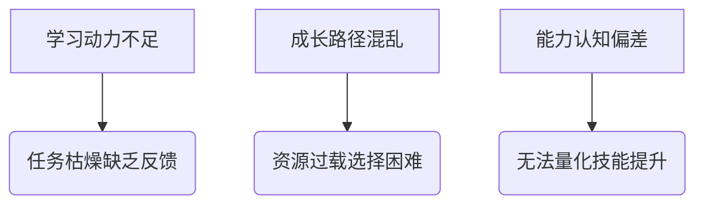
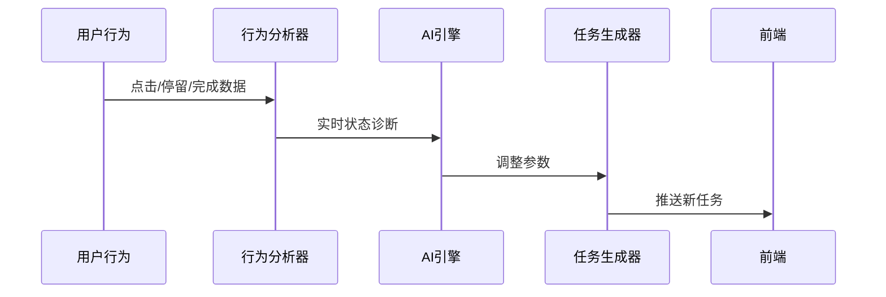

# AI-Gamified-Growth-Platform
> Version 1.0 | 针对18-35岁自我提升人群的AI游戏化成长系统（老爷爷系统）

## 一、产品概述
### 1.1 核心概念
将RPG游戏机制与AI个性化学习融合，通过：
- **任务线系统**：动态生成可升级的成长路径
- **装备养成体系**：可视化能力提升过程
- **AI Dungeon Master**：实时调整难度与奖励的智能教练

### 1.2 关键差异点
| 传统学习平台 | AI Quest |
|--------------|----------|
| 线性课程结构 | 开放世界式任务地图 |
| 固定成就体系 | 动态装备词条系统 |
| 人工进度跟踪 | AI难度平衡算法 |

---

## 二、用户画像
### 2.1 核心用户

- **奋斗型学生**：需要考研/语言考试系统规划
- **职场转型者**：跨领域技能树构建
- **自律困难户**：依赖游戏化正反馈机制

### 2.2 用户痛点


---

## 三、核心功能模块
### 3.1 任务管理系统（Quest Engine）
#### 3.1.1 动态任务生成
```python
# AI任务生成伪代码
def generate_quest(user):
    skill_gap = calculate_skill_gap(user.current_level, user.target)
    quest_type = select_quest_type(user.learning_style)  # 视觉/听觉/动手型
    difficulty = adaptive_difficulty(user.success_rate)
    return Quest(skill_gap, quest_type, difficulty)
```

#### 3.1.2 任务类型
| 任务类型 | 机制 | 案例 |
|---------|------|-----|
| 主线任务 | 长期目标拆解 | "Python大师之路：0→Kaggle竞赛" |
| 支线任务 | 碎片时间利用 | "地铁上完成10个日语听力挑战" |
| 限时副本 | 紧迫感训练 | "48小时数据分析黑客松" |
| 团队RAID | 社交学习 | "3人组队攻克LeetCode周赛" |

### 3.2 装备成长系统（Gear System）
#### 3.2.1 装备属性
```json
{
  "装备ID": "code_sword_2024",
  "属性加成": {
    "逻辑思维": "+15%",
    "专注力": "+10%",
    "抗压能力": "-5%"
  },
  "解锁条件": "连续7天每日编程≥2小时"
}
```

#### 3.2.2 装备类型
| 装备槽位 | 对应能力维度 | 示例 |
|---------|-------------|-----|
| 武器     | 核心技能     | Python光剑、设计神杖 |
| 护甲     | 知识储备     | 机器学习板甲、法律法典 |
| 饰品     | 软技能       | 时间管理沙漏、沟通徽章 |

### 3.3 AI教练系统（Dungeon Master AI）
#### 3.3.1 智能调节机制


#### 3.3.2 干预策略
| 用户状态 | AI动作 | 效果 |
|---------|--------|-----|
| 连续失败3次 | 降低任务难度+召唤导师NPC | 防止挫败感 |
| 效率下降50% | 启动「专注力试炼」副本 | 恢复心流状态 |
| 成就停滞期 | 生成跨领域联动任务 | 突破能力边界 |

---

## 四、技术架构
### 4.1 系统组件
```plaintext
[前端]
  ├─ Unity3D游戏引擎
  ├─ 实时数据仪表盘
  └─ 社交互动系统

[后端]
  ├─ 知识图谱引擎
  ├─ 强化学习调参模块
  └─ 用户行为分析管道

[AI]
  ├─ GPT-4任务生成器
  ├─ DRL难度控制器
  └─ CLIP多模态反馈
```

### 4.2 数据流向


---

## 五、运营策略
### 5.1 成长飞轮设计


### 5.2 变现模式
| 阶段   | 策略                  | 收入来源               |
|-------|-----------------------|-----------------------|
| 初期  | 装备皮肤NFT           | 数字商品交易           |
| 中期  | 企业人才数据服务      | B端按效果付费          |
| 长期  | 技能认证区块链        | 证书铸造gas费          |

---

## 六、开发计划
### 6.1 MVP功能清单
1. 基础任务生成引擎（GPT-3.5 Turbo）
2. 装备属性系统原型
3. 核心数据仪表盘

### 6.2 里程碑
| 季度 | 目标                  | 关键指标               |
|-----|-----------------------|-----------------------|
| Q1  | 核心玩法验证          | 用户平均任务完成率≥65% |
| Q2  | AI难度平衡上线        | 留存率提升40%         |
| Q3  | 社交系统开放          | 组队任务占比≥30%      |
| Q4  | 跨平台数据互通        | 多端使用率≥80%        |
